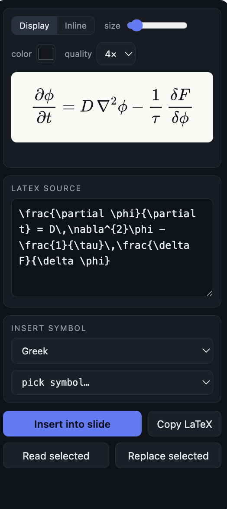

<p align="center">
  
</p>

<h1 align="center">Equation Workbench</h1>

<p align="center">Write LaTeX equations and insert them into Google Slides — rendered live, editable later, and crisp on screen.</p>

---

Type an equation in the sidebar, see it preview instantly, and drop it onto the current slide as a high‑resolution image. Later, select an inserted equation, pull its source back into the editor, tweak it, and replace it in place.

<p align="center">
  
</p>

There is also a no‑install **web version** with vector SVG export — see the link near the bottom.

---

## Features

- **Live preview** as you type LaTeX
- **Physics‑aware palette** — the `physics` package is included (`\dv`, `\pdv`, `\grad`, `\bra`, `\ket`, `\expval`, `\norm`, matrices, and more), in two dropdowns (category → symbol)
- **Insert into slide** — places the equation as a transparent, high‑resolution PNG on the open slide
- **Round‑trip editing** — *Read selected* loads an inserted equation's LaTeX back into the editor; *Replace selected* swaps it in place
- **Adjustable** size, color, and render quality (4× / 6× / 8×)
- Runs in your browser; only touches the presentation you have open

---

## Repository structure

```
equation-workbench/
├── README.md
├── LICENSE
├── src/
│   ├── Code.gs            # server logic: menu, sidebar, insert / read / replace
│   ├── Sidebar.html       # the editor UI (preview, LaTeX input, palette, buttons)
│   └── appsscript.json    # manifest: declares the two OAuth scopes
└── logo/
    ├── logo.svg           # app icon
    └── screenshot.png     # preview image
```

---

## Install — it's just 3 files

You don't need any deployment or publishing step. Paste the three files into an Apps Script project attached to a presentation, save, and use it. That's it.

1. Open a **Google Slides** presentation.
2. Go to **Extensions → Apps Script**. A script editor opens.
3. Replace the default `Code.gs` contents with **`src/Code.gs`**.
4. Click the **+** next to *Files* → **HTML** → name it exactly **`Sidebar`** → paste in **`src/Sidebar.html`**.
5. Open **Project Settings** (⚙️) → tick **"Show appsscript.json manifest file in editor"** → open `appsscript.json` → replace it with **`src/appsscript.json`**.
6. **Save** (💾), then go back to the Slides tab and **reload the page**.
7. A new menu appears: **Extensions → Equation Workbench → Open editor**. Click it.
8. **On first run, you'll see a warning that the app isn't verified — this is expected. Accept it** (instructions just below). After that, the sidebar opens and you're ready.

> The add‑on lives in this presentation (and any copy of it — **File → Make a copy** carries the script along). To reuse it in new decks, see "Use it in more presentations" below.

---

## ⚠️ The "Google hasn't verified this app" warning — this is normal, just accept it

On first run you'll see:

> **"This app hasn't been verified by Google. Because this app is requesting some access to your Google Account, you should continue only if you know and trust this app developer."**

**This is expected and safe to accept.** It appears for any self‑installed add‑on that hasn't gone through Google's public Marketplace review. It is **your own code**, and it only ever touches the presentation you currently have open — nothing else in your Google account or Drive.

**To accept it and continue:**

1. Click **Advanced** (bottom‑left of the warning).
2. Click **Go to Equation Workbench (unsafe)**.
3. Review the permissions and click **Allow**.

You only do this **once per Google account**. After that, the add‑on opens straight away, with no warning.

(The "unsafe" wording is just Google's standard label for any unverified app — it does not mean the code is harmful. The warning disappears only after a full Google Workspace Marketplace verification, which this simple self‑install intentionally skips.)

---

## How to use

1. In a presentation, open **Extensions → Equation Workbench → Open editor**.
2. Type LaTeX in the **LaTeX source** box (e.g. `\frac{\partial \phi}{\partial t} = D\,\nabla^2 \phi`). The preview updates live.
3. Use the **Insert symbol** dropdowns to add symbols at the cursor.
4. Adjust **size**, **color**, and **quality**.
5. Click a slide, then **Insert into slide** — the equation lands on it, centered.

**Edit an equation later:** click the equation on the slide → **Read selected** (loads its LaTeX back in) → edit → **Replace selected** (swaps it in place).

---

## Use it in more presentations

A bound script only lives in the presentation it was created in. To reuse it in new decks, keep that presentation as a **template** and copy it:

1. Set up the add‑on in one presentation (the install steps above), and keep that file as your template (e.g. name it "Equation Workbench — Template").
2. Whenever you start a new deck: open the template → **File → Make a copy** → rename it. The add‑on travels with the copy, so it's already under **Extensions** in the new deck.

> An add‑on only appears **automatically in every presentation** when it's installed from the **Google Workspace Marketplace** (the public, Google‑reviewed route). Without publishing there, the copy‑the‑template method above is the simple way to reuse it.

---

## Sharing with others

- **Best (works in all their decks):** send them this repo; they follow the install steps on their own Google account and accept the one‑time warning, then keep a template deck as above.
- **Quick:** share a presentation that already has the script bound to it (as Editor). They get it under **Extensions** in that deck and its copies.

A self‑installed (unverified) add‑on supports up to ~100 users — plenty for personal sharing.

---

## Permissions

The add‑on requests only what it needs:

- `presentations.currentonly` — read and edit **only the presentation you currently have open** (to insert equations and store/recover their LaTeX in the image's alt text). It cannot see your other Drive files.
- `script.container.ui` — show the sidebar inside Google Slides.

The LaTeX of each inserted equation is stored in that image's **alt‑text (description)** field, inside your own presentation — that's how *Read / Replace* recover the source. Nothing is sent to or stored on any external server; equations render in your browser via [MathJax](https://www.mathjax.org/).

---

## Web version (no install, vector export)

Prefer not to install anything, or need **vector SVG** for Keynote, PowerPoint, Illustrator, or LaTeX/Beamer?

**https://tanmoy456.github.io/equation-workbench/**

Live preview plus SVG, high‑resolution PNG, copy‑image, and copy‑LaTeX export.

---

## License

MIT — see [`LICENSE`](LICENSE). Built by gtanmoy. Equations render with [MathJax](https://www.mathjax.org/).
